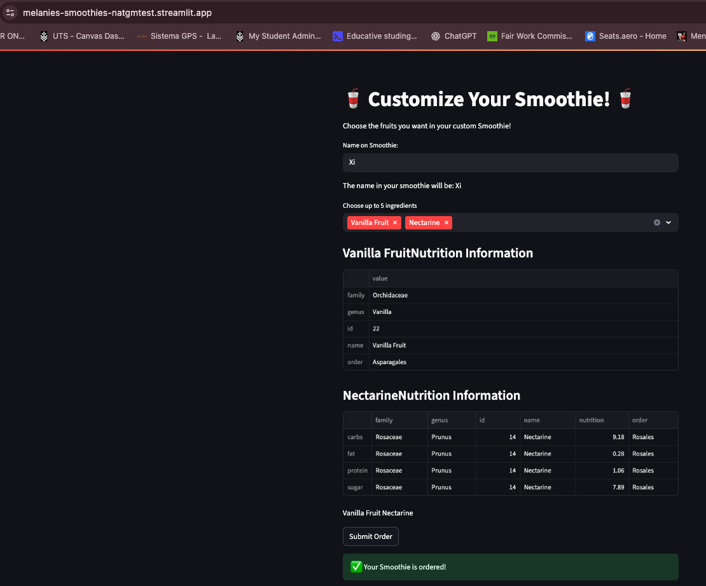

# 🥤 Melanie’s Smoothies

An interactive web app that lets users build their own smoothies by selecting fruits and placing custom orders. Built with [Streamlit](https://streamlit.io/) and backed by [Snowflake](https://www.snowflake.com/), this app demonstrates a simple but powerful use of cloud data pipelines and real-time user input.

---

## ✨ Features

- Choose up to 5 fruits to build your smoothie
- View nutritional information from the [Fruityvice API](https://www.fruityvice.com/)
- Place your order with your name
- Orders are stored in a Snowflake table for future reference

---

## 🧰 Tech Stack

- **Frontend**: [Streamlit](https://streamlit.io/)
- **Backend**: Python
- **Data Storage**: [Snowflake](https://www.snowflake.com/)
- **API**: [Fruityvice](https://www.fruityvice.com/)
- **Cloud Hosting**: [Streamlit Community Cloud](https://streamlit.io/cloud) — app auto-deployed from GitHub

---

## 🚀 Getting Started

### 1. Clone the Repository

```bash
git clone https://github.com/natashagmueller/melanies-smoothies.git
cd melanies-smoothies
```

### 2. Install Requirements

```bash
pip install -r requirements.txt
```

### 3. Run the App Locally

```bash
streamlit run streamlit_app.py
```

> 💡 If you're running in Snowflake’s Streamlit App, you don’t need to run locally—just publish the app through the Snowflake UI.

---

## 🧪 Sample Usage

1. Enter your name.
2. Select fruits (up to 5).
3. Review nutrition information.
4. Submit your smoothie order.
5. Success message + Snowflake storage!

---

## 🗄️ Snowflake Table Schema

| Table Name        | Columns                          |
|-------------------|----------------------------------|
| `smoothie_orders` | `name_on_order`, `ingredients`   |
| `fruit_options`   | `FRUIT_NAME`, `SEARCH_ON`        |

---

## 📸 Screenshots



---

## 🧑‍💻 Contributing

Pull requests are welcome! For major changes, please open an issue first to discuss what you'd like to change.

---

## 📜 License

[MIT](LICENSE) — feel free to use and adapt.

---

## 🙌 Acknowledgements

- [Streamlit](https://streamlit.io/)
- [Fruityvice API](https://www.fruityvice.com/)
- [Snowflake](https://www.snowflake.com/)
- Inspired by [Snowflake's Streamlit Workshop](https://quickstarts.snowflake.com/)
